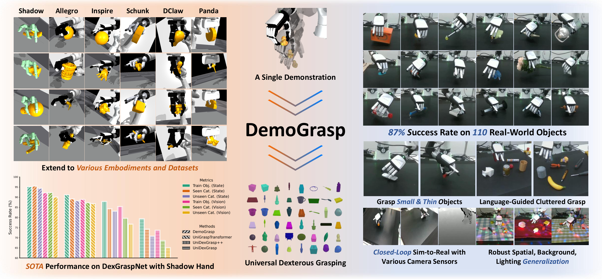

# DemoGrasp: Universal Dexterous Grasping from a Single Demonstration
Official code for **DemoGrasp: Universal Dexterous Grasping from a Single Demonstration** *(ICLR 2026)*.

<div align="center">

[[Paper]](https://openreview.net/forum?id=Bf4FeuW0Mr)
[[arXiv]](https://arxiv.org/abs/2509.22149)
[[Website]](https://beingbeyond.github.io/DemoGrasp/)

[]()
[]()



</div>

DemoGrasp is a framework for learning universal dexterous grasping policies via reinforcement learning (RL) augmented with a single demonstration. It achieves state-of-the-art performance across diverse robotic hand embodiments and transfers effectively to real robots, demonstrating strong generalization.


## Requirements
- Create a conda environment with python 3.8.19, then install packages:
```
conda create -n demograsp python=3.8.19
conda activate demograsp

pip install torch==2.3.0+cu121 torchvision==0.18.0+cu121 torchaudio==2.3.0 --index-url https://download.pytorch.org/whl/cu121

pip install numpy==1.23.5 sapien==3.0.0b0 chumpy==0.70 addict==2.4.0 yapf==0.43.0 h5py sorcery==0.2.2 pynvml==11.5.0 ipdb==0.13.13 matplotlib==3.5.1 networkx==3.1 tqdm==4.66.4 datasets==3.1.0 einops==0.4.1 jsonlines

```

- Install [IsaacGym Preview 4](https://developer.nvidia.com/isaac-gym) and [IsaacGymEnvs](https://github.com/isaac-sim/IsaacGymEnvs).

- Download assets and checkpoints from [this link](https://drive.google.com/drive/folders/1NXDcMI5IXalOwauryWvXCz3h2n2IzBQ6?usp=sharing).
    - Unzip `robots.zip`, `union_ycb_unidex.zip`, and `textures.zip` into the `assets/` folder.
    - Unzip `ckpt.zip` into the project root.

- Your project structure should look like:
```
DemoGrasp/
├── assets/
│   ├── textures/
│   ├── union_ycb_unidex/
│   ├── franka/
│   ├── inspire_tac/
│   ├── ...
├── ckpt/
│   ├── inspire.pt
│   ├── ...
```

## QuickStart

- Try our object-centric demonstration replay:
```
python run_rl_grasp.py task=grasp num_envs=16 task.env.asset.multiObjectList="union_ycb_unidex/example.yaml" +debug=test_demo_replay
```
You can see the Inspire hand grasping different objects with the same position, orientation, and hand pose.

## Play the trained RL policies

- For Inspire hand, run:
```
python run_rl_grasp.py task=grasp train=PPOOneStep test=True num_envs=175 task.env.observationType="eefpose+objinitpose+objpcl" task.env.armController=pose task.env.asset.multiObjectList="union_ycb_unidex/union_ycb_debugset.yaml" task.env.randomizeTrackingReference=True task.env.randomizeGraspPose=True task.env.trackingReferenceFile=tasks/grasp_ref_inspire.pkl task.env.episodeLength=50 task.env.enablePointCloud=True train.params.is_vision=True checkpoint='ckpt/inspire.pt'
```

- Use `headless=True` on a headless machine. To evaluate on unseen object categories in DexGraspNet, set `task.env.asset.multiObjectList="union_ycb_unidex/test_set_unseen_cat.yaml"`.

- Scripts for all hands are listed in `play_policy.sh`

## Training

- For Inspire hand, run:
```
python -u run_rl_grasp.py \
    task=grasp \
    train=PPOOneStep \
    hand=fr3_inspire_tac \
    num_envs=7000 \
    task.env.armController=pose \
    task.env.trackingReferenceFile=tasks/grasp_ref_inspire.pkl \
    task.env.trackingReferenceLiftTimestep=13 \
    task.env.asset.multiObjectList="union_ycb_unidex/union_ycb_debugset.yaml" \
    task.env.randomizeTrackingReference=True \
    task.env.randomizeGraspPose=True \
    task.env.resetDofPosRandomInterval=0.2 \
    task.env.observationType="eefpose+objinitpose+objpcl" \
    task.env.episodeLength=40 \
    task.env.enablePointCloud=True \
    train.params.is_vision=True \
    task.env.enableRobotTableCollision=False
```
Checkpoints and tensorboard logs are saved in `runs_ppo/`.

- Use `headless=True` on a headless machine. To train on DexGraspNet benchmark (3200 objects),
set `task.env.asset.multiObjectList="union_ycb_unidex/train_set.yaml" headless=True num_envs=6400`.

- Scripts for all hands are listed in `train.sh`. 
Policies are expected to achieve high success rates after 2000 training iterations.

## Collect robot dataset with image observations

- A headed machine with at least 20GB of GPU memory is required.

- For Inspire hand, run:
```
python run_rl_grasp.py \
    task=grasp \
    train=PPOOneStep \
    task.env.asset.multiObjectList="union_ycb_unidex/union_ycb_debugset.yaml" \
    task.env.observationType="eefpose+objinitpose+objpcl" \
    task.env.armController=pose \
    task.env.randomizeTrackingReference=True \
    task.env.randomizeGraspPose=True \
    task.env.trackingReferenceFile=tasks/grasp_ref_inspire.pkl \
    task.env.enablePointCloud=True \
    train.params.is_vision=True \
    task.env.render.enable=True \
    task.env.render.camera_ids="[1,2]" \
    task.env.render.data_type="rgb" \
    task.env.render.randomize=True \
    task.env.render.randomization_params.camera_pos="[-0.02,0.02]" \
    task.env.render.randomization_params.camera_quat="[-0.02,0.02]" \
    task.env.render.randomization_params.table_xyz="[0.05,0.02,0]" \
    task.env.episodeLength=40 \
    checkpoint='ckpt/inspire.pt' \
    +debug=collect_real_dataset \
    num_envs=175 \
    +num_episodes=30000
```
Set `+num_episodes` to the total number of successful trajectories to collect.
The dataset will be saved in `data/datasets/$robot_name_$datetime` in LeRobot v2.0 format.

- You can use any imitation learning method to train an RGB-based policy on this dataset. 
To achieve sim-to-real deployment on your robot, you should revise the robot configurations, 
camera intrinsics and extrinsics, and table sizes to match your hardware settings.

## Acknowledgments
Our codebase builds upon the following projects:
- [UniDexGrasp](https://github.com/PKU-EPIC/UniDexGrasp)
- [CrossDex](https://github.com/PKU-RL/CrossDex)
- [ResDex](https://github.com/PKU-RL/ResDex)
- [LeRobot](https://github.com/huggingface/lerobot)

# Citation
If you find our work useful, please consider citing us!
```
@article{yuan2025demograsp,
  title={DemoGrasp: Universal Dexterous Grasping from a Single Demonstration},
  author={Yuan, Haoqi and Huang, Ziye and Wang, Ye and Mao, Chuan and Xu, Chaoyi and Lu, Zongqing},
  journal={arXiv preprint arXiv:2509.22149},
  year={2025}
}
```