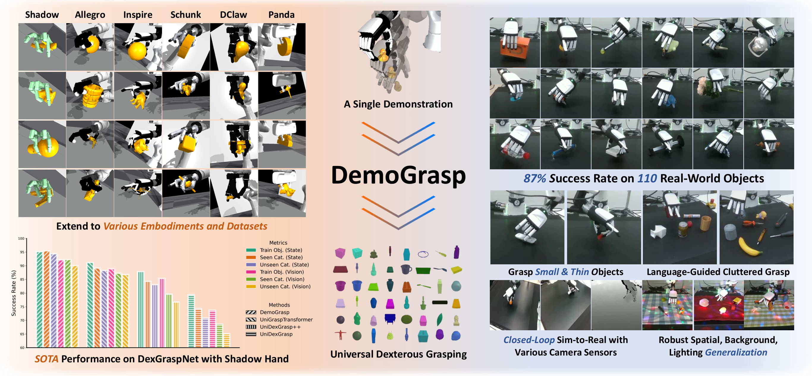

# DemoGrasp: Universal Dexterous Grasping from a Single Demonstration

<div align="center">

[[Website]](xxx)
[[arXiv]](xxx)

[]()
[]()



</div>

coming soon...


# Citation
If you find our work useful, please consider citing us!
```
xxx
```
